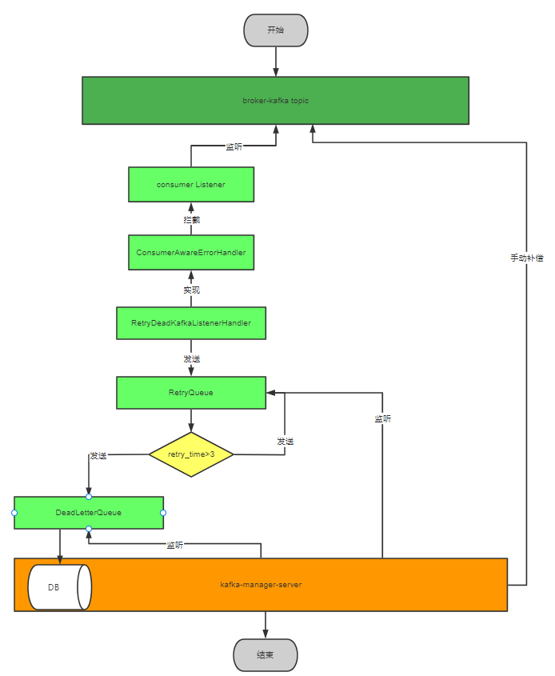

**<h1>kafka消息管理</h1>**
**目的：**  
系统中运用到了kafka用来解耦异步处理业务逻辑，由于目前系统中对kafka的引用没有做任何兜底处理，消息丢失之后无法找回，且处理比较麻烦，因此对kafka做一些功能补充，同时还可以用来做事务最终一致性解决方案。

**当前kafka-manager功能：**  
- 重试队列，对消费异常的消息可以进行重试，可能消费是由于网络引起，那此时消息发送到重试队列会进行重试，每10s发送一次，一共3次。
- 死信队列，消息经过重试队列发送3次之后，还无法正常消费，则说明消费端已经无法正常使用了，因此将消息发送到死信队列中，并将死信队列的消息持久化到DB中，方便后续消费者恢复之后手动补偿。  
- 延迟队列，目前没有场景，暂时不做，后续如果有场景会将延迟队列增加。  
**retry流程图：**  

  
**代码配置：**  
只需引入maven即可
```java
<dependency>
    <groupId>com.slk.kafka</groupId>
    <artifactId>slk-kafka-client</artifactId>
    <version>1.0.0</version>
</dependency>
```
**死信队列数据管理：**  
1.kafka重试次数大于3次（最大次数），客户端将数据推送至死信队列。
2·kafka-server通过监听死信队列，将消息获取之后存入DB中。
3·提供手动补偿接口，将消息重新发送至原始topic中，此外还提供一些界面可视化接口，例如死信数据基本信息，后期可接入kafka监控，用于丰富管理。  

**延迟队列实现逻辑：**  
1·客户端发送消息，通过实现``ProducerInterceptor`` 接口，对发送的消息进行拦截，获取``header``中的``sendTimestamp``字段的消息，修改发送topic为延迟队列，并将原信息全部记录到``header``中。
2·kafka-server通过监听延迟队列消息，将消息存入redis的队列中（使用redisson的DelayQueue）。
3·等redisson的DelayQueue消息延迟时间到了，将会被take，根据消息的``header``信息，将消息发送至原topic中即可。


